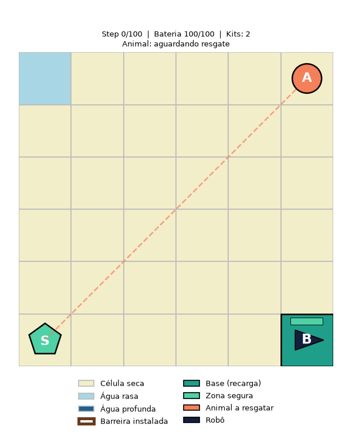
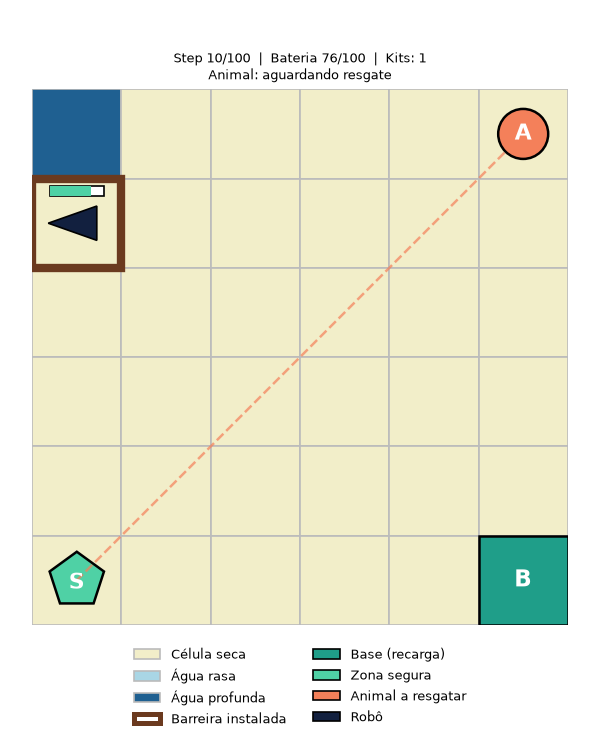
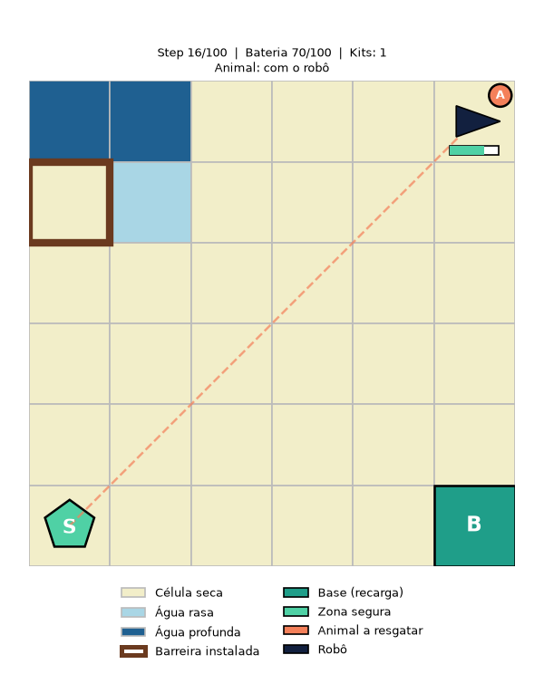
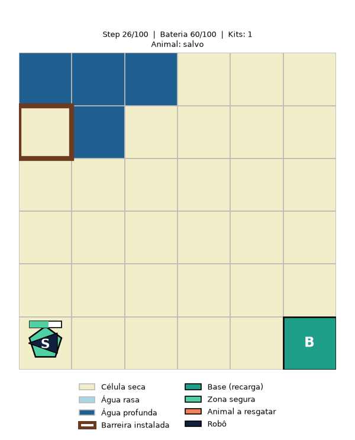

# FloodGuard

Ambiente Gymnasium e experimentos de aprendizado por reforço profundo para o
problema de contenção de enchente e resgate de animais (versão simplificada:
1 animal, grid 6×6). Ver `proposta-validacao-enchente-simplificada.md` para a
formalização completa do MDP e `plano-execucao.md` para o plano de execução
do trabalho por etapas.

## Estrutura do projeto

```
floodguard/
  envs/flood_guard_env.py   # MDP / ambiente Gymnasium (Etapa 1 — implementado)
  rendering/renderer.py     # visualização via matplotlib (Etapa 2 — implementado)
  utils/seeding.py          # utilitário de reprodutibilidade
experiments/                # scripts de treino, renderização de exemplo e otimização de hiperparâmetros
  random_baseline.py        # baseline aleatório / sanity check do ambiente (Etapa 3)
  train.py                  # treino default DQN/PPO/A2C com stable-baselines3 (Etapa 4)
  tune.py                   # busca Optuna de hiperparâmetros (Etapa 5)
  final_experiments.py      # treino multi-seed e comparação final (Etapa 6)
notebooks/                  # relatório final em literate programming (Etapa 7)
results/
  baselines/                # métricas do agente aleatório (Etapa 3)
  models/                   # checkpoints treinados (não versionado)
  logs/                     # logs de treino / tensorboard / optuna (não versionado)
  figures/                  # gráficos e imagens usados no relatório (versionado)
tests/                      # testes automatizados (pytest)
```

## Setup

**Requisito:** Python **3.10, 3.11 ou 3.12** (`stable-baselines3`/`torch`
ainda não têm suporte estável a versões mais novas — se `python3 --version`
no seu sistema já mostra 3.13+, use o `uv` como abaixo em vez do `python3`
do sistema).

Este projeto usa [`uv`](https://docs.astral.sh/uv/) para criar o ambiente
virtual com a versão correta do Python, mesmo que o Python padrão do sistema
seja outra versão:

```bash
# instala uv, se ainda não tiver
curl -LsSf https://astral.sh/uv/install.sh | sh

# cria o venv com Python 3.11 e instala as dependências
uv venv --python 3.11 .venv
source .venv/bin/activate
uv pip install -r requirements.txt
uv pip install -e .   # instala o pacote `floodguard` em modo editável
```

Alternativamente, com `venv`/`pip` puro (garanta antes que `python3
--version` está entre 3.10 e 3.12):

```bash
python3 -m venv .venv
source .venv/bin/activate
pip install -r requirements.txt
pip install -e .
```

`requirements.txt` fixa faixas de versão compatíveis; `requirements-lock.txt`
registra as versões exatas instaladas no ambiente usado para gerar os
resultados do relatório (útil para reprodutibilidade exata, não para
instalação do zero).

## Rodando os testes

```bash
source .venv/bin/activate
pytest
```

`tests/test_setup.py` (Etapa 0) confirma que as dependências estão
instaladas, que o ambiente `FloodGuard-v0` está registrado no Gymnasium e
que a seed global é determinística. `tests/test_env.py` (Etapa 1) cobre a
dinâmica do MDP em si: reset determinístico, custos de movimento, bloqueio
por água profunda/borda, barreiras, resgate/entrega, perda do animal,
bateria zerada, truncamento por steps e conformidade com a API do
Gymnasium (`check_env`). `tests/test_rendering.py` (Etapa 2) cobre a
renderização: formato/dtype do frame RGB, os diferentes status do animal e
comportamento de `render()` sem `render_mode`.

## Visualização

`env.render()` (com `FloodGuardEnv(render_mode="rgb_array")`) retorna um
frame RGB do estado atual do grid — robô, animal, base, zona segura, água
por nível de inundação e barreiras instaladas, no estilo do mockup em
`assets/floodguard_mockup_simplificado.png`. Para gerar um episódio de
exemplo (imagens + GIF) em `results/figures/`:

```bash
source .venv/bin/activate
python experiments/render_example_episode.py
```

Episódio de exemplo (política heurística fixa, só para ilustrar as
mecânicas do ambiente — não é um agente treinado):


| Estado inicial | Barreira instalada | Animal resgatado | Entrega concluída |
|---|---|---|---|
|  |  |  |  |

## Baseline aleatório / sanity check

A Etapa 3 roda uma política uniformemente aleatória para verificar se o
ambiente está calibrado antes dos treinos com DQN, PPO e A2C. O script salva
métricas por episódio, resumo agregado e um relatório curto:

```bash
source .venv/bin/activate
python experiments/random_baseline.py --episodes 1000 --seed 42
```

Arquivos gerados em `results/baselines/`:

- `random_baseline_episodes.csv` — métricas por episódio.
- `random_baseline_summary.json` — resumo agregado para reuso em scripts.
- `random_baseline_report.md` — leitura do sanity check e métricas
  fixadas para as próximas etapas.

Nesta calibração, `flood_advance_prob` foi reduzido para `0.05` e
`flood_deepen_prob` permanece em `0.10`, deixando a taxa de sucesso aleatória
baixa, mas não nula, sem tornar a perda do animal irrelevante.

### Métricas da Etapa 3

O ambiente inclui campos extras em `info` para tornar a avaliação dos
episódios auditável. Essas métricas não alteram a dinâmica do MDP; apenas
registram o que aconteceu durante o episódio.

| Métrica | Significado |
|---|---|
| `battery_spent` | Energia acumulada gasta em movimentos e instalação de barreiras. É diferente da bateria final, porque o robô pode recarregar na base. |
| `termination_reason` | Motivo do fim do episódio: `success`, `animal_lost`, `battery_depleted`, `max_steps` ou `running` enquanto o episódio ainda não terminou. |
| `barriers_installed` | Número de barreiras realmente instaladas no episódio. Ações inválidas de instalação não entram nessa contagem. |
| `effective_barriers_installed` | Número de barreiras instaladas em células com risco imediato: célula rasa ou célula seca adjacente à água. |
| `pickup_step` | Step em que o robô pegou o animal pela primeira vez. Fica `None` se o animal nunca foi coletado. |
| `delivery_step` | Step em que o robô entregou o animal na zona segura. Fica `None` se não houve sucesso. |

No resumo agregado do baseline, esses campos viram métricas como
`battery_spent_mean`, `battery_depleted_rate`,
`barriers_installed_mean`, `effective_barriers_installed_mean` e
`steps_to_success_mean`, usadas depois para comparar DQN, PPO e A2C.

## Etapa 4 - Treino com Stable-Baselines3

A Etapa 4 treina e avalia DQN, PPO e A2C com 500.000 timesteps, seed 42 e
hiperparâmetros padrão do Stable-Baselines3. A avaliação é **determinística**
(ação de maior valor/probabilidade); use `--stochastic-eval` para o modo
estocástico.

```bash
source .venv/bin/activate
python experiments/train.py --algo dqn
python experiments/train.py --algo ppo
python experiments/train.py --algo a2c
```

Os resultados e os links para os artefatos estão no
[relatório consolidado da Etapa 4](results/relatorio_etapa_4.md).

### Política de avaliação: determinística

Todos os resultados usam a política **determinística**: é a política que o
algoritmo aprendeu e a única comparável entre os três. No SB3, o modo
"estocástico" do PPO/A2C amostra da distribuição de ações, mas no DQN é
ε-greedy com o ε final do treino — não é uma política aprendida. A avaliação
estocástica é reportada apenas como análise secundária (Etapa 6).

Toda avaliação também mede travamentos (`stall_step_rate`,
`stalled_episode_rate`): passos consecutivos sem nenhum efeito no robô.

### Observação normalizada (correção importante)

O `Box` achatado da observação é inteiro (`int64`) e o `RescaleObservation` do
Gymnasium mantém esse dtype, truncando posição, bateria e passos restantes para
0/1. Uma versão anterior do pipeline treinava e avaliava com essa observação
degenerada. `NormalizeObservation` (em `experiments/train.py`) converte para
`float32` antes de normalizar; há teste de regressão em `tests/test_train.py`.
Todos os resultados do repositório foram regerados após a correção.

## Etapa 5 - Otimizacao com Optuna

A Etapa 5 busca hiperparâmetros melhores para DQN, PPO e A2C. Cada execução
salva o banco SQLite do Optuna (versionado), um CSV com todos os trials, os
retornos intermediários, o JSON com a melhor configuração, gráficos em
`results/figures/` e atualiza o
[relatório consolidado da Etapa 5](results/relatorio_etapa_5.md).

Protocolo:

- todos os trials têm o **mesmo orçamento** (100.000 passos), a **mesma seed de
  treino** e os **mesmos episódios de avaliação**; o banco guarda o orçamento e
  recusa trials de outro protocolo;
- o trial 0 são os **hiperparâmetros default do SB3**, para medir o ganho real
  da otimização;
- avaliação determinística; objetivo = retorno médio das avaliações ao longo do
  treino parcial (área sob a curva), que desempata configurações que chegam ao
  ótimo por velocidade de convergência;
- `MedianPruner` só atua após um período de aquecimento.

Busca completa (30 trials por algoritmo; várias execuções podem compartilhar o
mesmo banco para paralelizar, ex.: 3 processos com `--n-trials 10`):

```bash
source .venv/bin/activate
export OMP_NUM_THREADS=1   # redes minúsculas: mais threads só geram contenção
python experiments/tune.py --algo dqn --n-trials 30 --total-timesteps 100000
python experiments/tune.py --algo ppo --n-trials 30 --total-timesteps 100000
python experiments/tune.py --algo a2c --n-trials 30 --total-timesteps 100000
```

Smoke test rápido:

```bash
python experiments/tune.py --algo a2c --n-trials 1 --total-timesteps 32 --eval-episodes 1 --eval-freq 0
```

## Etapa 6 - Experimentos finais

A Etapa 6 treina, com 5 seeds e 500.000 passos, a configuração otimizada e a
default do SB3 de cada algoritmo, avalia todos em 100 episódios de teste
(determinístico como principal, estocástico como secundário), compara com o
agente aleatório e, opcionalmente, treina ablações do PPO (sem barreiras e sem
reward shaping) para investigar o comportamento de proteção.

```bash
source .venv/bin/activate
export OMP_NUM_THREADS=1
python experiments/final_experiments.py --workers 8 --ablations
```

O script salva os modelos (`results/models/final/`, versionados), resultados por
seed e por episódio, curvas de treino e de avaliação periódica
(`results/final/*.csv`), gráficos, GIFs de um episódio por algoritmo e o
[relatório consolidado da Etapa 6](results/relatorio_etapa_6.md).

## Etapa 7 - Relatório (notebook)

O relatório final está em [`notebooks/relatorio.ipynb`](notebooks/relatorio.ipynb) (versão
exportada: [`notebooks/relatorio.html`](notebooks/relatorio.html)). Ele lê todos os dados de `results/`,
então basta reexecutá-lo depois de qualquer novo experimento:

```bash
source .venv/bin/activate
jupyter nbconvert --to notebook --execute --inplace notebooks/relatorio.ipynb
jupyter nbconvert --to html notebooks/relatorio.ipynb
```

## Reprodutibilidade

Use `floodguard.utils.set_global_seed(seed)` no início de qualquer script de
treino/avaliação/otimização para fixar as seeds de `random`, `numpy` e
`torch` de forma consistente entre os experimentos.
