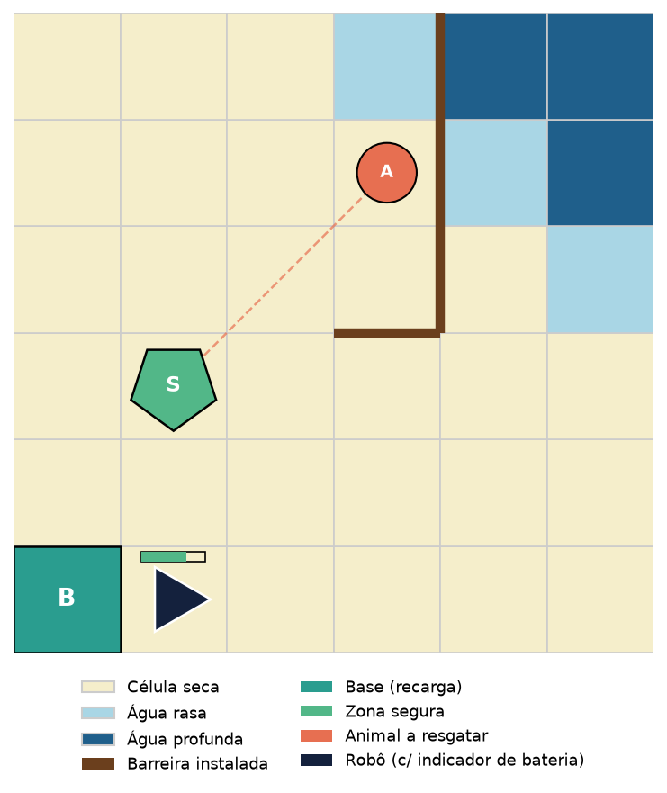

# FloodGuard (versão simplificada): Contenção de Enchente e Resgate de Animais

**Proposta de trabalho para validação — Aprendizado por Reforço / Modelagem de MDPs**

> Esta é uma versão simplificada da proposta original (ver `proposta-validacao-enchente.md`),
> reduzindo o problema a **um único animal** a resgatar em um grid **6×6** (em vez
> de 3 animais em um grid 8×8), mantendo as demais componentes do MDP (bateria,
> barreiras, avanço estocástico da água). O objetivo é oferecer uma alternativa de
> menor complexidade, seja como escopo definitivo, seja como uma primeira versão
> (MVP) a ser expandida para múltiplos animais caso o tempo do trabalho permita —
> no mesmo espírito da simplificação já feita para o EcoDelivery (ver
> `proposta-validacao-simplificada.md`).

## 1. Contexto e motivação

O trabalho propõe modelar e implementar, como ambiente Gymnasium, o problema de um
robô autônomo que atua em uma região fictícia de Porto Alegre durante uma enchente
intensificada por um evento El Niño. Mesmo com um único animal a resgatar, o
ambiente ainda combina quatro subproblemas de RL: navegação em um mapa que se
degrada com o tempo, gestão de recurso escasso (bateria), uma dinâmica estocástica
de propagação (avanço da água) e uma decisão de priorização — o agente precisa
decidir entre gastar tempo/bateria instalando barreiras (proteção preventiva) ou
seguir diretamente para o resgate, já que as duas ações competem pelo mesmo
orçamento de tempo e energia.

## 2. Descrição do problema

- Região representada por um grid **N×N** (proposta inicial: **6×6**, reduzido em
  relação à versão original de 8×8 para manter o espaço de estados compacto, já que
  há apenas um animal).
- Um **foco de enchente** fixo em uma borda/canto do grid, a partir do qual a água
  se propaga célula a célula ao longo do tempo.
- Cada célula tem um **nível de inundação**: seca, água rasa ou água profunda.
- **1 único animal** ilhado, em posição fixa, que precisa ser resgatado antes que
  sua célula fique com água profunda.
- **1 base de recarga** fixa (ponto de partida do robô).
- **1 zona segura** fixa, para onde o animal resgatado deve ser levado.
- O robô pode **instalar barreiras** em células (proposta inicial: 1 a 2 kits
  disponíveis por episódio), o que impede/reduz o avanço da água para elas.
- O robô carrega **no máximo 1 animal por vez** (natural, já que há apenas um).
- Observação **total** do grid (sem observabilidade parcial).

## 3. Formalização do MDP

### Estado (S)

- Posição do robô `(x, y)` no grid
- Nível de bateria (ex.: 0–100)
- Mapa de inundação atual (matriz 6×6 com estado de cada célula: seca / rasa /
  profunda)
- Mapa de barreiras instaladas
- Número de kits de barreira restantes
- Status do animal (aguardando resgate / com o robô / salvo / perdido) e sua
  posição
- Steps restantes no episódio

### Ação (A)

Espaço discreto com 6 ações:

- `mover_cima`, `mover_baixo`, `mover_esquerda`, `mover_direita`
- `instalar_barreira` (protege a célula atual contra avanço da água, consome 1 kit
  e um custo elevado de bateria)
- `esperar/carregar` (recarrega bateria se o robô estiver sobre a base)

Resgate do animal e entrega na zona segura ocorrem automaticamente quando o robô
ocupa a célula correspondente, sem exigir ação dedicada.

### Transição (P)

- Movimento é determinístico em termos de deslocamento no grid.
- Custo de bateria por movimento é variável: célula seca custa 1 unidade, célula
  com água rasa custa 2–3 unidades; água profunda é intransponível.
- **Avanço estocástico da água**: a cada step, toda célula seca adjacente a uma
  célula já inundada tem probabilidade `p` de passar a água rasa; toda célula com
  água rasa tem probabilidade `q` de passar a água profunda. Células com barreira
  instalada têm probabilidade de inundação reduzida a (quase) zero.
- Instalar barreira transforma a célula atual em "protegida" e consome 1 kit de
  barreira do robô.
- Se a célula do animal (ainda não resgatado) se torna água profunda, o animal é
  considerado **perdido**.
- Permanecer sobre a base (ação `esperar/carregar`) recupera bateria a uma taxa
  fixa por step.

### Recompensa (R)

- `+15` a `+25` por resgatar e entregar o animal na zona segura (escalável
  conforme o risco evitado)
- `+5` por instalar uma barreira que efetivamente protege uma célula que seria
  inundada nos steps seguintes
- `-1` por step (custo de tempo)
- Penalidade negativa se o animal for perdido (episódio termina)
- Penalidade grande e **terminal** caso a bateria chegue a 0 fora da base

### Terminação de episódio

- O animal foi resgatado e entregue, **ou**
- o animal foi perdido (inundado antes do resgate), **ou**
- limite máximo de steps foi atingido, **ou**
- a bateria zerou fora da base.

### Fator de desconto (γ)

A definir empiricamente durante os experimentos (proposta inicial: 0.99).

## 4. Visualização / renderização

*Mockup ilustrativo do cenário simplificado: o triângulo azul-escuro representa o
robô (com indicador de bateria), o círculo "A" é o animal a resgatar (conectado por
linha tracejada à zona segura), o pentágono verde "S" é a zona segura, o quadrado
verde-azulado "B" é a base de recarga, a linha marrom é uma barreira instalada e as
células em azul-claro/azul-escuro representam água rasa/profunda.*

Renderização via matplotlib (e possivelmente pygame para uma versão animada).

## 5. Algoritmos propostos (stable-baselines3)

Mantém-se a proposta original: espaço de ação discreto, comparando três
algoritmos com paradigmas distintos:

| Algoritmo | Paradigma | Justificativa |
|---|---|---|
| **DQN** | Value-based, off-policy | Baseline clássico para ação discreta, permite comparação com replay buffer |
| **PPO** | Policy-gradient, on-policy | Robusto e amplamente usado como referência atual em RL profundo |
| **A2C** | Actor-critic, on-policy | Mais simples que PPO, contraste interessante em estabilidade/sample efficiency |

Os hiperparâmetros de cada algoritmo serão otimizados (proposta: busca via
Optuna), reportando não apenas a melhor configuração, mas também as demais
configurações testadas.

## 6. Vantagens desta versão simplificada

- Reduz a dimensionalidade do estado (não é necessário representar status/posição
  de múltiplos animais) e o próprio grid é menor (6×6 em vez de 8×8), o que deve
  acelerar o treinamento e facilitar a depuração do ambiente e da dinâmica de
  propagação da água.
- Mantém todos os elementos centrais do MDP (navegação, bateria, barreiras, avanço
  estocástico da água), preservando o trade-off proteção-vs-resgate que é o
  diferencial deste cenário em relação ao EcoDelivery.
- Serve como base sólida para, se houver tempo, evoluir para a versão com múltiplos
  animais (K > 1) descrita na proposta original, bastando estender o espaço de
  estados e a lógica de recompensa.

## 7. Próximos passos após validação

1. Implementação do ambiente Gymnasium (`FloodGuardEnv`)
2. Implementação dos mecanismos de renderização
3. Implementação e otimização de hiperparâmetros dos três algoritmos
4. Condução dos experimentos e análise dos resultados
5. Redação do relatório em estilo literate programming (notebook)

## 8. Pontos em aberto para discussão com o professor

- Escolha entre este cenário (FloodGuard) e o EcoDelivery como escopo definitivo do
  trabalho
- Validação do escopo simplificado (1 animal, grid 6×6) como suficiente para os
  objetivos da disciplina, versus a versão com múltiplos animais
- Validação das regras de propagação da água (probabilidades `p` e `q`) e da
  mecânica de barreiras (kits limitados)
- Validação dos três algoritmos propostos (DQN, PPO, A2C)
- Sugestões de ajuste na função de recompensa, se necessário
