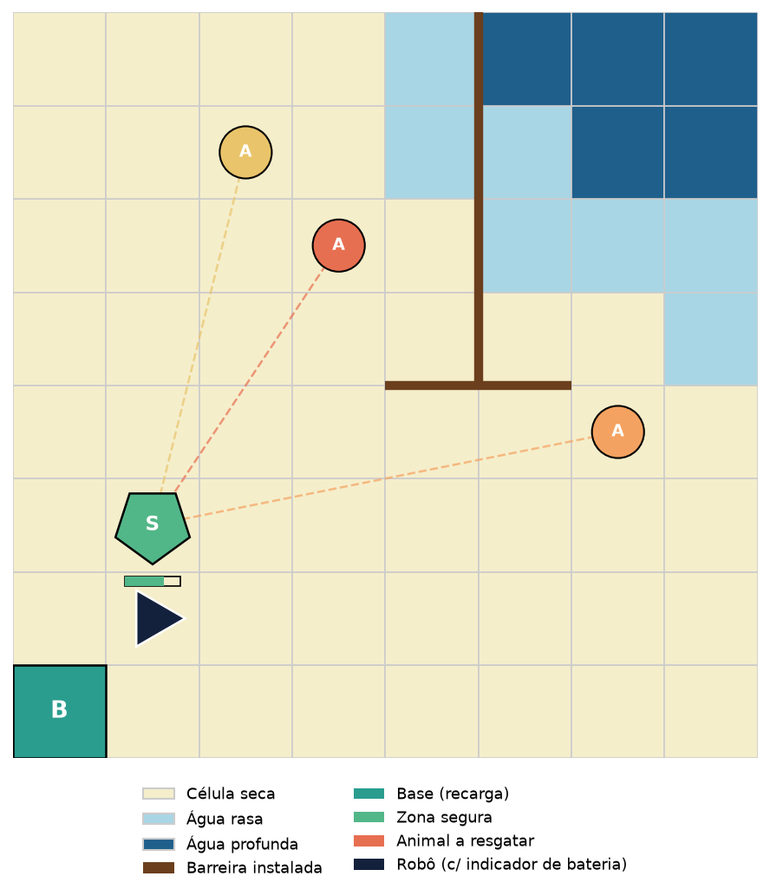

# FloodGuard: Contenção de Enchente e Resgate de Animais em Porto Alegre

**Proposta de trabalho para validação — Aprendizado por Reforço / Modelagem de MDPs**

> Esta é uma proposta **alternativa** ao EcoDelivery (ver `proposta-validacao.md` e
> `proposta-validacao-simplificada.md`), apresentada ao professor para que ele possa
> escolher/validar qual dos dois cenários seguirá para implementação.

## 1. Contexto e motivação

O trabalho propõe modelar e implementar, como ambiente Gymnasium, o problema de um
robô autônomo que atua em uma região fictícia de Porto Alegre durante uma enchente
intensificada por um evento El Niño. O robô precisa **instalar barreiras** para
conter o avanço da água, **resgatar animais** que ficam ilhados e levá-los até uma
área segura, gerenciando uma **bateria limitada** que exige retornos periódicos à
base para recarga. O cenário é inspirado nas enchentes que atingiram o Rio Grande do
Sul, dando um contexto local e atual ao problema.

O ambiente combina quatro subproblemas de RL em um único MDP: navegação em um mapa
que se degrada com o tempo, gestão de recurso escasso (bateria), uma dinâmica
estocástica de propagação (avanço da água, análogo a um autômato celular
probabilístico) e uma decisão de **priorização multi-objetivo** — o agente precisa
decidir, a cada momento, entre proteger área com barreiras ou resgatar animais,
já que ambas as ações competem pelo mesmo recurso (tempo e bateria).

## 2. Descrição do problema

- Região representada por um grid **N×N** (proposta inicial: **8×8**).
- Um **foco de enchente** (ex.: margem de um rio) fixo em uma borda do grid, a
  partir do qual a água se propaga célula a célula ao longo do tempo.
- Cada célula tem um **nível de inundação**: seca, água rasa ou água profunda.
- **K animais** ilhados (proposta inicial: 3), cada um em uma posição fixa, que
  precisam ser resgatados antes que sua célula fique com água profunda.
- **1 base de recarga** fixa (ponto de partida do robô).
- **1 zona segura** fixa, para onde os animais resgatados devem ser levados.
- O robô pode **instalar barreiras** em células, o que impede (ou reduz fortemente)
  o avanço da água para elas, mas consome bateria e um recurso limitado de "kits de
  barreira".
- O robô carrega **no máximo 1 animal por vez**.
- Observação **total** do grid (sem observabilidade parcial).

## 3. Formalização do MDP

### Estado (S)

- Posição do robô `(x, y)` no grid
- Nível de bateria (ex.: 0–100)
- Mapa de inundação atual (matriz N×N com estado de cada célula: seca / rasa /
  profunda)
- Mapa de barreiras instaladas (quais células estão protegidas)
- Número de kits de barreira restantes
- Para cada animal: status (aguardando resgate / com o robô / salvo / perdido) e
  posição
- Steps restantes no episódio

### Ação (A)

Espaço discreto com 6 ações:

- `mover_cima`, `mover_baixo`, `mover_esquerda`, `mover_direita`
- `instalar_barreira` (protege a célula atual contra avanço da água, consome 1 kit
  e um custo elevado de bateria)
- `esperar/carregar` (recarrega bateria se o robô estiver sobre a base)

Resgate de animal (quando o robô ocupa a célula do animal) e entrega na zona segura
(quando o robô, carregando um animal, ocupa a célula da zona segura) ocorrem
automaticamente, sem exigir ação dedicada — mantendo o espaço de ação enxuto, como
no EcoDelivery.

### Transição (P)

- Movimento é determinístico em termos de deslocamento no grid.
- Custo de bateria por movimento é variável conforme o terreno: célula seca custa 1
  unidade, célula com água rasa custa 2–3 unidades; água profunda é intransponível
  (ação de mover para lá é inválida/sem efeito) — forçando o robô a desviar ou agir
  antes que a água avance demais.
- **Avanço estocástico da água**: a cada step, toda célula seca adjacente a uma
  célula já inundada tem probabilidade `p` de passar a água rasa; toda célula com
  água rasa tem probabilidade `q` de passar a água profunda. Células com barreira
  instalada têm probabilidade de inundação reduzida a (quase) zero. Essa regra é a
  componente estocástica central do MDP, análoga a um autômato celular
  probabilístico de propagação.
- Instalar barreira transforma a célula atual em "protegida" (bloqueia/reduz
  fortemente a propagação futura da água para ela) e consome 1 kit de barreira do
  robô (recurso finito por episódio).
- Se a célula onde está um animal ainda não resgatado se torna água profunda, o
  animal é considerado **perdido** (análogo ao deadline expirado de um pacote no
  EcoDelivery).
- Permanecer sobre a base (ação `esperar/carregar`) recupera bateria a uma taxa fixa
  por step.

### Recompensa (R)

- `+15` a `+25` por resgatar e entregar um animal na zona segura (escalável
  conforme o risco evitado, ex.: quão perto a célula do animal estava de inundar)
- `+5` por instalar uma barreira que efetivamente protege uma célula que seria
  inundada nos steps seguintes (incentiva proteção estratégica, não aleatória)
- `-1` por step (custo de tempo, incentiva ações eficientes)
- Penalidade negativa quando um animal é perdido (célula inundada antes do resgate)
- Penalidade grande e **terminal** caso a bateria chegue a 0 fora da base
- Penalidade caso o robô fique "encurralado" por água profunda sem conseguir
  retornar à base (a definir se é condição terminal ou apenas penalidade contínua)

### Terminação de episódio

- Todos os animais foram resgatados ou perdidos, **ou**
- limite máximo de steps foi atingido, **ou**
- a bateria zerou fora da base.

### Fator de desconto (γ)

A definir empiricamente durante os experimentos (proposta inicial: 0.99).

## 4. Visualização / renderização

*Mockup ilustrativo do cenário: o triângulo azul-escuro representa o robô (com
indicador de bateria), os círculos coloridos ("A") são animais a resgatar
(conectados por linha tracejada à zona segura), o pentágono verde ("S") é a zona
segura, o quadrado verde-azulado ("B") é a base de recarga, a linha marrom é uma
barreira instalada e as células em azul-claro/azul-escuro representam água
rasa/profunda, respectivamente.*

Renderização via matplotlib (e possivelmente pygame para uma versão animada):

- Robô como ícone móvel no grid, com indicador de bateria
- Células coloridas por nível de inundação (seca / rasa / profunda), atualizadas a
  cada step — permite visualizar claramente o avanço da enchente
- Barreiras destacadas visualmente (ex.: linha sólida na borda da célula protegida)
- Animais coloridos por status (aguardando / resgatado / perdido)
- Possibilidade de gerar tanto snapshots estáticos quanto animações (GIF) para
  ilustrar a evolução da enchente e a trajetória do robô no relatório final

## 5. Algoritmos propostos (stable-baselines3)

Mantém-se a mesma proposta do EcoDelivery: espaço de ação discreto, comparando três
algoritmos com paradigmas distintos:

| Algoritmo | Paradigma | Justificativa |
|---|---|---|
| **DQN** | Value-based, off-policy | Baseline clássico para ação discreta, permite comparação com replay buffer |
| **PPO** | Policy-gradient, on-policy | Robusto e amplamente usado como referência atual em RL profundo |
| **A2C** | Actor-critic, on-policy | Mais simples que PPO, contraste interessante em estabilidade/sample efficiency |

Os hiperparâmetros de cada algoritmo serão otimizados (proposta: busca via Optuna),
reportando não apenas a melhor configuração, mas também as demais configurações
testadas.

## 6. Comparação com o EcoDelivery

| Aspecto | EcoDelivery (simplificado) | FloodGuard |
|---|---|---|
| Dinâmica do ambiente | Congestionamento vai e volta (reversível) | Água avança e é (majoritariamente) irreversível — pressão temporal crescente |
| Estrutura de decisão | Coleta → entrega de 1 pacote | Multi-objetivo: proteger (barreiras) vs. resgatar (animais), competindo por tempo/bateria |
| Espaço de ação | 5 ações | 6 ações (+ instalar barreira) |
| Complexidade do estado | Posição + bateria + pacote + congestionamento | Posição + bateria + mapa de inundação + barreiras + múltiplos animais |
| Apelo/tema | Logística urbana | Tema atual e local (enchentes no RS) |

O FloodGuard é mais rico em termos de decisão estratégica (trade-off explícito
entre prevenção e resgate), mas também mais complexo em termos de espaço de
estados — pode exigir uma versão simplificada inicial (grid menor, menos animais,
sem múltiplos níveis de água) caso o treinamento se mostre muito lento, seguindo o
mesmo padrão de simplificação já adotado no EcoDelivery.

## 7. Próximos passos após validação

1. Implementação do ambiente Gymnasium (`FloodGuardEnv`)
2. Implementação dos mecanismos de renderização
3. Implementação e otimização de hiperparâmetros dos três algoritmos
4. Condução dos experimentos e análise dos resultados
5. Redação do relatório em estilo literate programming (notebook)

## 8. Pontos em aberto para discussão com o professor

- Escolha entre este cenário (FloodGuard) e o EcoDelivery como escopo definitivo do
  trabalho
- Validação do tamanho do grid, número de animais e regras de propagação da água
  (probabilidades `p` e `q`)
- Validação da mecânica de barreiras (kits limitados vs. custo de bateria apenas,
  sem limite de quantidade)
- Validação dos três algoritmos propostos (DQN, PPO, A2C)
- Definição da condição de "encurralamento" (terminal ou não) e ajustes na função
  de recompensa
