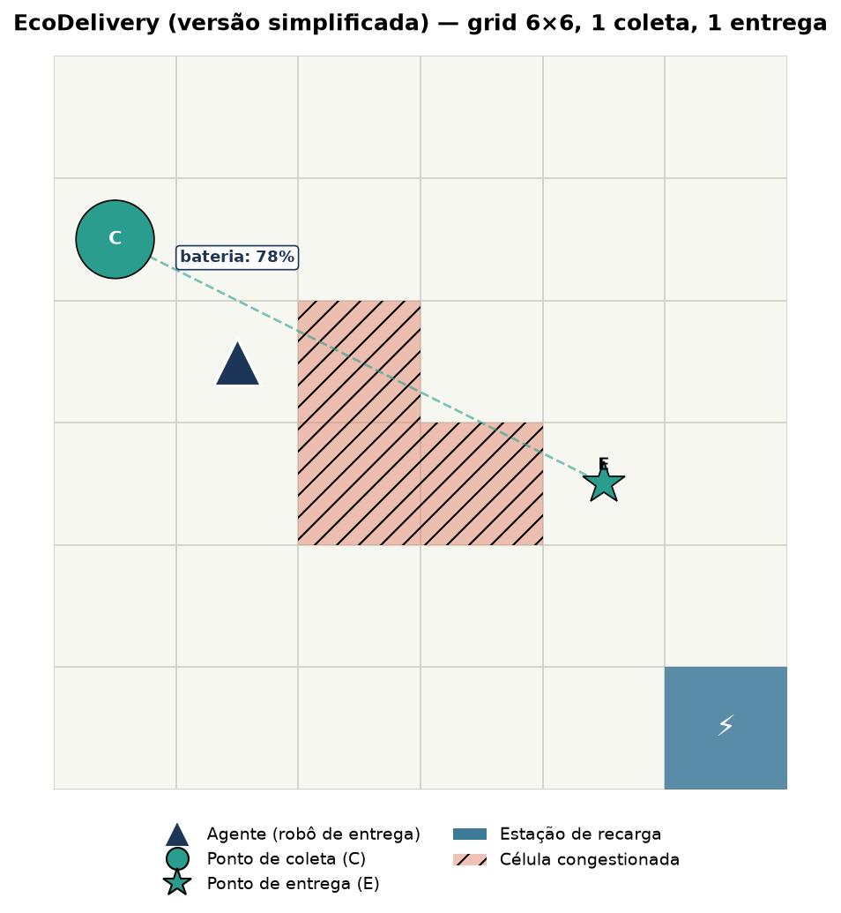

# EcoDelivery (versão simplificada): Roteamento de Entrega com Restrição de Bateria

**Proposta de trabalho para validação — Aprendizado por Reforço / Modelagem de MDPs**

> Esta é uma versão simplificada da proposta original (ver `proposta-validacao.md`),
> reduzindo o problema a **um único pacote** (um ponto de coleta e um ponto de
> entrega), mantendo as demais componentes do MDP (bateria, congestionamento
> estocástico, estação de recarga). O objetivo é oferecer uma alternativa de menor
> complexidade, seja como escopo definitivo, seja como uma primeira versão (MVP) a
> ser expandida para múltiplos pacotes caso o tempo do trabalho permita.

## 1. Contexto e motivação

O trabalho propõe modelar e implementar, como ambiente Gymnasium, o problema de um
robô de entregas elétrico que precisa transportar **um pacote** em uma cidade
representada como grid, respeitando um prazo de entrega e gerenciando uma bateria
limitada. Mesmo com um único pacote, o ambiente ainda combina três subproblemas
clássicos de RL: navegação, gestão de recurso escasso (bateria) e uma componente
estocástica (congestionamento de tráfego) que impede soluções triviais por busca
determinística.

## 2. Descrição do problema

- Cidade representada por um grid **N×N** (proposta inicial: **6×6**, reduzido em
  relação à versão original de 10×10 para manter o espaço de estados compacto,
  já que há apenas um pacote).
- **1 único pacote**, com:
  - 1 local de coleta (C)
  - 1 local de entrega (E)
  - um prazo (deadline, em número de steps)
- **1 estação de recarga** fixa no grid.
- **Zonas de congestionamento** que mudam de estado ao longo do tempo de forma
  estocástica, aumentando o custo de bateria para atravessá-las.
- O agente carrega **no máximo 1 pacote por vez** (natural, já que há apenas um).
- Observação **total** do grid (sem observabilidade parcial).

## 3. Formalização do MDP

### Estado (S)

- Posição do agente `(x, y)` no grid
- Nível de bateria (ex.: 0–100)
- Status do pacote (aguardando coleta / com o agente / entregue) e steps restantes
  até o deadline
- Mapa de congestionamento atual (quais células/zonas estão congestionadas)
- Steps restantes no episódio

### Ação (A)

Espaço discreto com 5 ações:

- `mover_cima`, `mover_baixo`, `mover_esquerda`, `mover_direita`
- `esperar/carregar` (recarrega bateria se o agente estiver sobre a estação)

Coleta e entrega do pacote ocorrem automaticamente quando o agente ocupa a célula
correspondente.

### Transição (P)

- Movimento é determinístico em termos de deslocamento no grid.
- Custo de bateria por movimento é variável: célula normal custa 1 unidade, célula
  congestionada custa 2–3 unidades.
- O estado de congestionamento de cada zona evolui estocasticamente ao longo do
  tempo (cadeia de Markov simples: congestionada ↔ livre, com probabilidades de
  transição fixas).
- Permanecer sobre a estação de recarga (ação `esperar/carregar`) recupera bateria
  a uma taxa fixa por step.

### Recompensa (R)

- `+10` a `+20` pela entrega concluída (escalável conforme a folga restante até o
  deadline, incentivando entrega antecipada)
- `-1` por step (custo de tempo, incentiva rotas eficientes)
- Penalidade negativa se o prazo do pacote expirar sem entrega (episódio termina)
- Penalidade grande e **terminal** caso a bateria chegue a 0 fora da estação de
  recarga (agente "encalha")

### Terminação de episódio

- O pacote foi entregue, **ou**
- limite máximo de steps foi atingido, **ou**
- o prazo do pacote expirou, **ou**
- a bateria zerou fora da estação de recarga.

### Fator de desconto (γ)

A definir empiricamente durante os experimentos (proposta inicial: 0.99).

## 4. Visualização / renderização

*Mockup ilustrativo do cenário simplificado: o triângulo azul-escuro representa o
agente (com indicador de bateria), o círculo "C" é o ponto de coleta e a estrela
"E" é o ponto de entrega (conectados por uma linha tracejada), o quadrado azul é a
estação de recarga e as células hachuradas representam zonas de congestionamento
no momento do snapshot.*

Renderização via matplotlib (e possivelmente pygame para uma versão animada).

## 5. Algoritmos propostos (stable-baselines3)

Mantém-se a proposta original: espaço de ação discreto, comparando três
algoritmos com paradigmas distintos:

| Algoritmo | Paradigma | Justificativa |
|---|---|---|
| **DQN** | Value-based, off-policy | Baseline clássico para ação discreta, permite comparação com replay buffer |
| **PPO** | Policy-gradient, on-policy | Robusto e amplamente usado como referência atual em RL profundo |
| **A2C** | Actor-critic, on-policy | Mais simples que PPO, contraste interessante em estabilidade/sample efficiency |

Os hiperparâmetros de cada algoritmo serão otimizados (proposta: busca via
Optuna), reportando não apenas a melhor configuração, mas também as demais
configurações testadas.

## 6. Vantagens desta versão simplificada

- Reduz a dimensionalidade do estado (não é necessário representar status/deadline
  de múltiplos pacotes) e o próprio grid é menor (6×6 em vez de 10×10), o que deve
  acelerar o treinamento e facilitar a depuração do ambiente.
- Mantém todos os elementos centrais do MDP (navegação, bateria, congestionamento
  estocástico), preservando a riqueza necessária para justificar o uso de RL.
- Serve como base sólida para, se houver tempo, evoluir para a versão com múltiplos
  pacotes (K > 1) descrita na proposta original, bastando estender o espaço de
  estados e a lógica de recompensa.

## 7. Próximos passos após validação

1. Implementação do ambiente Gymnasium (`EcoDeliveryEnv`)
2. Implementação dos mecanismos de renderização
3. Implementação e otimização de hiperparâmetros dos três algoritmos
4. Condução dos experimentos e análise dos resultados
5. Redação do relatório em estilo literate programming (notebook)

## 8. Pontos em aberto para discussão com o professor

- Validação do escopo simplificado (1 pacote) como suficiente para os objetivos da
  disciplina, versus a versão com múltiplos pacotes
- Validação do tamanho do grid e da quantidade/comportamento das zonas de
  congestionamento
- Validação dos três algoritmos propostos (DQN, PPO, A2C)
- Sugestões de ajuste na função de recompensa, se necessário
