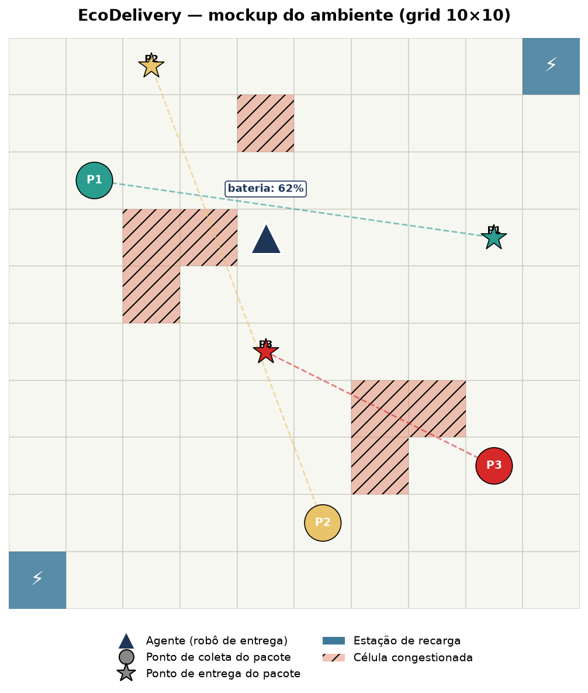

# EcoDelivery: Roteamento de Entregas com Restrição de Bateria

**Proposta de trabalho para validação — Aprendizado por Reforço / Modelagem de MDPs**

## 1. Contexto e motivação

O trabalho propõe modelar e implementar, como ambiente Gymnasium, o problema de um
robô de entregas elétrico que precisa transportar pacotes em uma cidade representada
como grid, respeitando prazos de entrega e gerenciando uma bateria limitada. O
ambiente combina três subproblemas clássicos de RL em um único MDP: navegação,
gestão de recurso escasso (bateria) e agendamento sob prazos (deadlines), com uma
componente estocástica (congestionamento de tráfego) que impede soluções triviais
por busca determinística.

## 2. Descrição do problema

- Cidade representada por um grid **N×N** (proposta inicial: 10×10).
- **K pacotes** (proposta inicial: 3 a 5), cada um com:
  - local de coleta
  - local de entrega
  - prazo (deadline, em número de steps)
- **2 a 3 estações de recarga** fixas no grid.
- **Zonas de congestionamento** que mudam de estado ao longo do tempo de forma
  estocástica, aumentando o custo de bateria para atravessá-las.
- O agente carrega **no máximo 1 pacote por vez** (capacidade unitária), com
  observação **total** do grid (sem observabilidade parcial) — escopo definido para
  manter o trabalho tratável dentro do prazo da disciplina.

## 3. Formalização do MDP

### Estado (S)

- Posição do agente `(x, y)` no grid
- Nível de bateria (ex.: 0–100)
- Para cada pacote: status (aguardando coleta / com o agente / entregue) e steps
  restantes até o deadline
- Mapa de congestionamento atual (quais células/zonas estão congestionadas)
- Steps restantes no episódio

### Ação (A)

Espaço discreto com 5 ações:

- `mover_cima`, `mover_baixo`, `mover_esquerda`, `mover_direita`
- `esperar/carregar` (recarrega bateria se o agente estiver sobre uma estação)

Coleta e entrega de pacotes ocorrem automaticamente quando o agente ocupa a célula
correspondente, sem exigir uma ação dedicada — o que mantém o espaço de ação
enxuto.

### Transição (P)

- Movimento é determinístico em termos de deslocamento no grid.
- Custo de bateria por movimento é variável: célula normal custa 1 unidade, célula
  congestionada custa 2–3 unidades.
- O estado de congestionamento de cada zona evolui estocasticamente ao longo do
  tempo (cadeia de Markov simples: congestionada ↔ livre, com probabilidades de
  transição fixas), o que introduz a componente estocástica do MDP.
- Permanecer sobre uma estação de recarga (ação `esperar/carregar`) recupera
  bateria a uma taxa fixa por step.

### Recompensa (R)

- `+10` a `+20` por entrega concluída (escalável conforme a folga restante até o
  deadline, incentivando entregas antecipadas)
- `-1` por step (custo de tempo, incentiva rotas eficientes)
- Penalidade negativa quando o prazo de um pacote expira sem entrega (episódio
  continua, mas o pacote é perdido)
- Penalidade grande e **terminal** caso a bateria chegue a 0 fora de uma estação de
  recarga (agente "encalha")

### Terminação de episódio

- Todos os pacotes foram entregues, **ou**
- limite máximo de steps foi atingido, **ou**
- bateria zerou fora de uma estação de recarga.

### Fator de desconto (γ)

A definir empiricamente durante os experimentos (proposta inicial: 0.99, dado que
episódios podem ter algumas centenas de steps).

## 4. Visualização / renderização

*Mockup ilustrativo do cenário: o triângulo azul-escuro representa o agente (com
indicador de bateria), os círculos são pontos de coleta e as estrelas são pontos de
entrega (conectados por linhas tracejadas, coloridas por urgência do pacote), os
quadrados azuis são estações de recarga e as células hachuradas representam zonas
de congestionamento no momento do snapshot.*

Renderização via matplotlib (e possivelmente pygame para uma versão animada):

- Agente representado como ícone móvel no grid
- Pacotes coloridos por urgência (verde → vermelho conforme o prazo se aproxima)
- Estações de recarga com ícone próprio
- Células congestionadas destacadas visualmente
- Possibilidade de gerar tanto snapshots estáticos quanto animações (GIF) para
  ilustrar trajetórias no relatório final

## 5. Algoritmos propostos (stable-baselines3)

Como o espaço de ação é discreto, propõe-se comparar três algoritmos com
paradigmas distintos, permitindo uma discussão rica no relatório:

| Algoritmo | Paradigma | Justificativa |
|---|---|---|
| **DQN** | Value-based, off-policy | Baseline clássico para ação discreta, permite comparação com replay buffer |
| **PPO** | Policy-gradient, on-policy | Robusto e amplamente usado como referência atual em RL profundo |
| **A2C** | Actor-critic, on-policy | Mais simples que PPO, contraste interessante em estabilidade/sample efficiency |

Os hiperparâmetros de cada algoritmo serão otimizados (proposta: busca via
Optuna), reportando não apenas a melhor configuração, mas também as demais
configurações testadas.

## 6. Próximos passos após validação

1. Implementação do ambiente Gymnasium (`EcoDeliveryEnv`)
2. Implementação dos mecanismos de renderização
3. Implementação e otimização de hiperparâmetros dos três algoritmos
4. Condução dos experimentos e análise dos resultados
5. Redação do relatório em estilo literate programming (notebook)

## 7. Pontos em aberto para discussão com o professor

- Validação do escopo de complexidade (tamanho do grid, número de pacotes,
  número de estações de recarga)
- Validação dos três algoritmos propostos (DQN, PPO, A2C)
- Sugestões de ajuste na função de recompensa, se necessário
