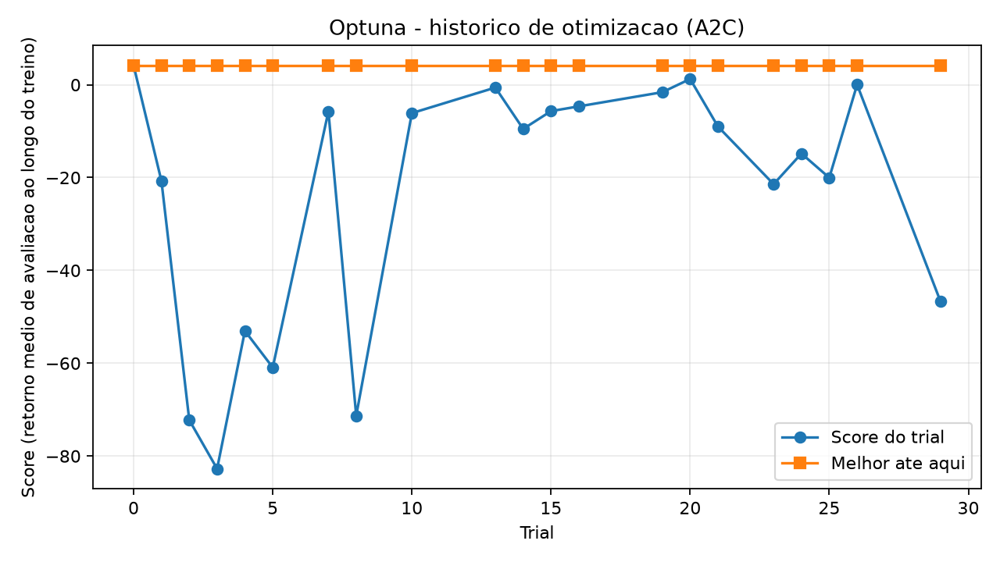
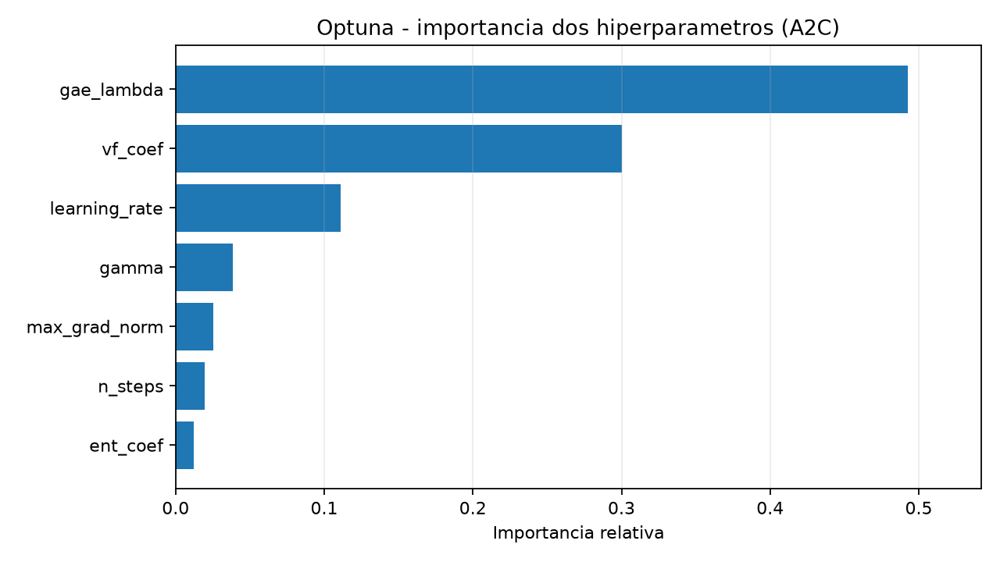
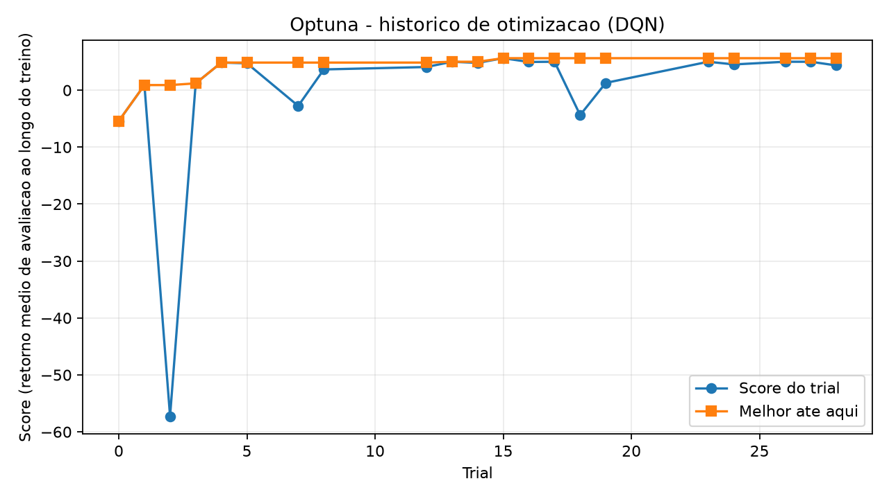
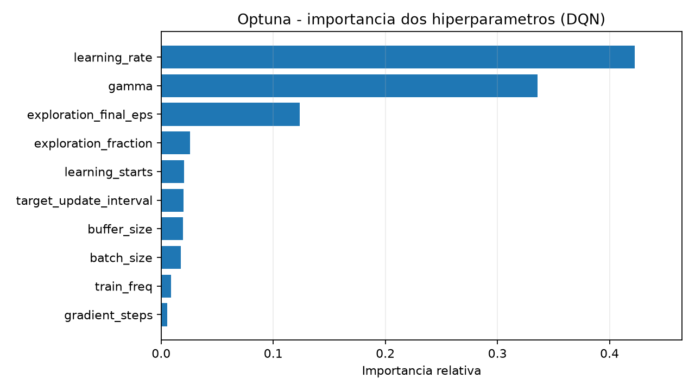
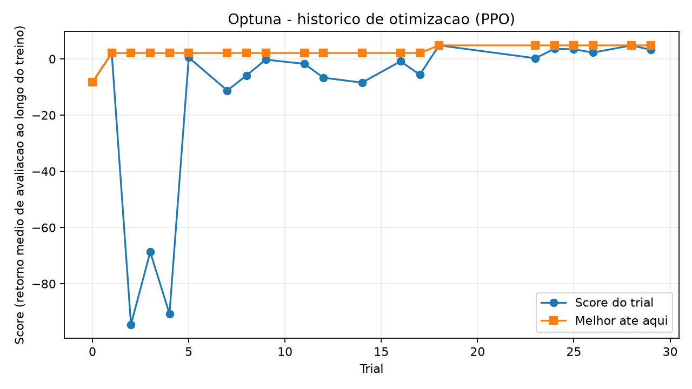
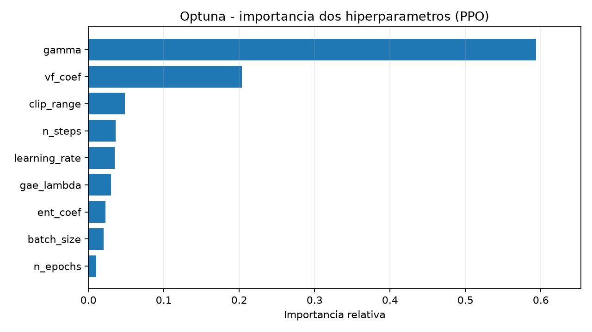

# FloodGuard - Relatorio da Etapa 5

Gerado em `2026-09-20 14:47:33` por `experiments/tune.py`.

## Resumo

A Etapa 5 executou a busca de hiperparametros de DQN, PPO e A2C com Optuna. Cada estudo tem o mesmo orcamento em todos os trials, avalia a politica **deterministica** e inclui os hiperparametros default do SB3 como trial 0, de modo que o ganho da otimizacao e medido contra o default.

## Objetivo

Encontrar configuracoes promissoras para cada algoritmo. O criterio e o retorno medio de avaliacao **ao longo do treino parcial** (area sob a curva de aprendizado): como o cenario inicial e fixo, varias configuracoes atingem o retorno otimo ao final do treino, e a media ao longo do treino as desempata pela velocidade de convergencia. O retorno da avaliacao final tambem e registrado (`final_return_mean`). O treino usa o sinal denso de progresso da Etapa 4; a avaliacao usa a recompensa original do MDP.

## Protocolo da busca

- `TPESampler` propoe novas configuracoes com base nos resultados anteriores.
- `MedianPruner` encerra trials abaixo da mediana, somente apos um periodo de aquecimento (`--pruner-warmup-evals` avaliacoes intermediarias).
- **Seed de treino e episodios de avaliacao fixos** em todos os trials, para que a diferenca entre trials venha dos hiperparametros.
- **Avaliacao deterministica**: acao de maior valor/probabilidade. No DQN a avaliacao estocastica seria epsilon-greedy com o `exploration_final_eps` do proprio modelo, o que faria a busca otimizar o modo de avaliacao.
- O banco SQLite guarda o orcamento do estudo; tentar reutiliza-lo com outro orcamento gera erro, evitando misturar trials incomparaveis.
- Todos os trials, inclusive os podados, ficam no SQLite, em `*_trials.csv` e (retornos intermediarios) em `*_intermediate.csv`.

| Algoritmo | Passos por trial | Episodios de avaliacao final | Episodios de avaliacao do pruning | Avaliacao |
|---|---:|---:|---:|---|
| A2C | 100000 | 50 | 20 | deterministic |
| DQN | 100000 | 50 | 20 | deterministic |
| PPO | 100000 | 50 | 20 | deterministic |

## Resultados

| Algoritmo | Trials | Completos | Podados | Score do default | Melhor score | Retorno final (melhor) | Sucesso (melhor) | Perda do animal (melhor) |
|---|---:|---:|---:|---:|---:|---:|---:|---:|
| A2C | 30 | 21 | 9 | 4.14 | 4.14 | 4.18 | 100.00% | 0.00% |
| DQN | 30 | 21 | 9 | -5.40 | 5.62 | 5.00 | 98.00% | 0.00% |
| PPO | 30 | 21 | 9 | -8.31 | 4.82 | 5.00 | 100.00% | 0.00% |

## Leitura dos resultados

- **A2C:** melhor score 4.14 (trial 0, 100.00% de sucesso); o default do SB3 obteve 4.14 (ganho de 0.00). O default foi o melhor trial: a busca nao superou o default.
- **DQN:** melhor score 5.62 (trial 15, 98.00% de sucesso); o default do SB3 obteve -5.40 (ganho de 11.02).
- **PPO:** melhor score 4.82 (trial 18, 100.00% de sucesso); o default do SB3 obteve -8.31 (ganho de 13.13).
- Todos os trials usam a mesma seed de treino, os mesmos episodios de avaliacao e o mesmo orcamento; diferencas pequenas de retorno estao dentro do ruido de 1 seed e devem ser confirmadas na Etapa 6 com varias seeds.

## Graficos

### A2C

### DQN

### PPO

## Melhores configuracoes

### A2C

Trial selecionado: `0`. Score: `4.14`.

| Metrica | Valor |
|---|---:|
| Retorno medio | 4.18 +/- 5.80 |
| Taxa de sucesso | 100.00% |
| Taxa de perda do animal | 0.00% |
| Taxa de truncamento | 0.00% |
| Uso medio de bateria | 15.00 |

| Hiperparametro | Valor |
|---|---:|
| `ent_coef` | `1e-08` |
| `gae_lambda` | `1` |
| `gamma` | `0.99` |
| `learning_rate` | `0.0007` |
| `max_grad_norm` | `0.5` |
| `n_steps` | `5` |
| `vf_coef` | `0.5` |

### DQN

Trial selecionado: `15`. Score: `5.62`.

| Metrica | Valor |
|---|---:|
| Retorno medio | 5.00 +/- 15.90 |
| Taxa de sucesso | 98.00% |
| Taxa de perda do animal | 0.00% |
| Taxa de truncamento | 2.00% |
| Uso medio de bateria | 31.30 |

| Hiperparametro | Valor |
|---|---:|
| `batch_size` | `128` |
| `buffer_size` | `25000` |
| `exploration_final_eps` | `0.0982582` |
| `exploration_fraction` | `0.296085` |
| `gamma` | `0.951787` |
| `gradient_steps` | `4` |
| `learning_rate` | `0.00101328` |
| `learning_starts` | `1000` |
| `target_update_interval` | `5000` |
| `train_freq` | `4` |

### PPO

Trial selecionado: `18`. Score: `4.82`.

| Metrica | Valor |
|---|---:|
| Retorno medio | 5.00 +/- 0.00 |
| Taxa de sucesso | 100.00% |
| Taxa de perda do animal | 0.00% |
| Taxa de truncamento | 0.00% |
| Uso medio de bateria | 15.00 |

| Hiperparametro | Valor |
|---|---:|
| `batch_size` | `32` |
| `clip_range` | `0.181711` |
| `ent_coef` | `4.6016e-07` |
| `gae_lambda` | `0.894242` |
| `gamma` | `0.916231` |
| `learning_rate` | `0.000259625` |
| `n_epochs` | `20` |
| `n_steps` | `512` |
| `vf_coef` | `0.389459` |

## Todas as configuracoes testadas

Score = media dos retornos de avaliacao ao longo do treino. Trials podados mostram o ultimo retorno intermediario (com o passo em que foram encerrados). O trial `DEFAULT` usa os hiperparametros padrao do SB3.

### A2C

| Trial | Estado | Score | Sucesso final | Hiperparametros |
|---:|---|---:|---:|---|
| 0 | DEFAULT | 4.14 | 100.00% | ent_coef=1e-08, gae_lambda=1, gamma=0.99, learning_rate=0.0007, max_grad_norm=0.5, n_steps=5, vf_coef=0.5 |
| 1 | COMPLETE | -20.73 | 100.00% | ent_coef=0.000106622, gae_lambda=0.877704, gamma=0.992149, learning_rate=0.000853612, max_grad_norm=0.999711, n_steps=50, vf_coef=0.660792 |
| 2 | COMPLETE | -72.24 | 66.00% | ent_coef=3.50982e-07, gae_lambda=0.935717, gamma=0.915129, learning_rate=6.2152e-05, max_grad_norm=0.968182, n_steps=50, vf_coef=0.977945 |
| 3 | COMPLETE | -82.75 | 0.00% | ent_coef=0.000837547, gae_lambda=0.934839, gamma=0.912345, learning_rate=6.33271e-05, max_grad_norm=0.620667, n_steps=50, vf_coef=0.562598 |
| 4 | COMPLETE | -53.05 | 94.00% | ent_coef=3.53828e-06, gae_lambda=0.925886, gamma=0.98995, learning_rate=0.000129801, max_grad_norm=0.337527, n_steps=100, vf_coef=0.953052 |
| 5 | COMPLETE | -60.91 | 100.00% | ent_coef=0.000106378, gae_lambda=0.973235, gamma=0.905803, learning_rate=8.46801e-05, max_grad_norm=0.314409, n_steps=5, vf_coef=0.781054 |
| 6 | PRUNED | -100.00 | n/a | ent_coef=4.39818e-05, gae_lambda=0.931033, gamma=0.993887, learning_rate=0.00106665, max_grad_norm=0.337821, n_steps=100, vf_coef=0.722712 |
| 7 | COMPLETE | -5.75 | 90.00% | ent_coef=1.25741e-08, gae_lambda=0.811167, gamma=0.952936, learning_rate=0.00285513, max_grad_norm=0.318181, n_steps=5, vf_coef=0.253135 |
| 8 | COMPLETE | -71.30 | 78.00% | ent_coef=1.00251e-08, gae_lambda=0.806493, gamma=0.95123, learning_rate=1.5362e-05, max_grad_norm=0.629152, n_steps=5, vf_coef=0.278684 |
| 9 | PRUNED | -100.00 | n/a | ent_coef=1.37843e-08, gae_lambda=0.803592, gamma=0.951752, learning_rate=1.32041e-05, max_grad_norm=0.683087, n_steps=5, vf_coef=0.279044 |
| 10 | COMPLETE | -6.11 | 100.00% | ent_coef=0.0216746, gae_lambda=0.997823, gamma=0.955116, learning_rate=0.00243981, max_grad_norm=0.604049, n_steps=20, vf_coef=0.27933 |
| 11 | PRUNED | -100.00 | n/a | ent_coef=0.0458796, gae_lambda=0.99945, gamma=0.960134, learning_rate=1.34568e-05, max_grad_norm=0.564592, n_steps=10, vf_coef=0.437359 |
| 12 | PRUNED | -100.00 | n/a | ent_coef=0.0483367, gae_lambda=0.858302, gamma=0.935724, learning_rate=0.000277686, max_grad_norm=0.810098, n_steps=20, vf_coef=0.449531 |
| 13 | COMPLETE | -0.61 | 100.00% | ent_coef=1.68274e-07, gae_lambda=0.859515, gamma=0.97021, learning_rate=0.00250571, max_grad_norm=0.473944, n_steps=20, vf_coef=0.440199 |
| 14 | COMPLETE | -9.52 | 100.00% | ent_coef=2.28716e-07, gae_lambda=0.852675, gamma=0.970385, learning_rate=0.000403123, max_grad_norm=0.45781, n_steps=5, vf_coef=0.448295 |
| 15 | COMPLETE | -5.68 | 98.00% | ent_coef=1.6518e-07, gae_lambda=0.854529, gamma=0.971958, learning_rate=0.00228332, max_grad_norm=0.456843, n_steps=5, vf_coef=0.434961 |
| 16 | COMPLETE | -4.65 | 100.00% | ent_coef=2.3604e-07, gae_lambda=0.877561, gamma=0.975227, learning_rate=0.000736287, max_grad_norm=0.469824, n_steps=20, vf_coef=0.421348 |
| 17 | PRUNED | -91.95 | n/a | ent_coef=1.26279e-07, gae_lambda=0.899031, gamma=0.976366, learning_rate=0.000629898, max_grad_norm=0.505199, n_steps=20, vf_coef=0.524181 |
| 18 | PRUNED | -28.95 | n/a | ent_coef=1.83329e-06, gae_lambda=0.893166, gamma=0.979114, learning_rate=0.000909905, max_grad_norm=0.458997, n_steps=20, vf_coef=0.565281 |
| 19 | COMPLETE | -1.60 | 100.00% | ent_coef=2.26231e-06, gae_lambda=0.9002, gamma=0.981256, learning_rate=0.00138867, max_grad_norm=0.740879, n_steps=10, vf_coef=0.559914 |
| 20 | COMPLETE | 1.24 | 98.00% | ent_coef=2.5394e-06, gae_lambda=0.963196, gamma=0.998882, learning_rate=0.00149925, max_grad_norm=0.718709, n_steps=10, vf_coef=0.602083 |
| 21 | COMPLETE | -9.01 | 100.00% | ent_coef=2.11813e-06, gae_lambda=0.825742, gamma=0.999836, learning_rate=0.000288311, max_grad_norm=0.746732, n_steps=10, vf_coef=0.373446 |
| 22 | PRUNED | -94.75 | n/a | ent_coef=4.45852e-08, gae_lambda=0.828732, gamma=0.938875, learning_rate=0.000268072, max_grad_norm=0.533042, n_steps=100, vf_coef=0.343945 |
| 23 | COMPLETE | -21.42 | 0.00% | ent_coef=4.48302e-08, gae_lambda=0.965703, gamma=0.987838, learning_rate=0.00154503, max_grad_norm=0.872984, n_steps=10, vf_coef=0.657637 |
| 24 | COMPLETE | -14.82 | 100.00% | ent_coef=1.05014e-05, gae_lambda=0.970619, gamma=0.9973, learning_rate=0.0015008, max_grad_norm=0.395721, n_steps=10, vf_coef=0.645168 |
| 25 | COMPLETE | -20.03 | 100.00% | ent_coef=2.12493e-05, gae_lambda=0.966879, gamma=0.986185, learning_rate=0.00182663, max_grad_norm=0.826129, n_steps=10, vf_coef=0.639944 |
| 26 | COMPLETE | 0.02 | 90.00% | ent_coef=7.29033e-07, gae_lambda=0.973114, gamma=0.966032, learning_rate=0.00170227, max_grad_norm=0.408232, n_steps=10, vf_coef=0.501392 |
| 27 | PRUNED | -16.35 | n/a | ent_coef=7.48671e-07, gae_lambda=0.956812, gamma=0.964892, learning_rate=0.000510949, max_grad_norm=0.408901, n_steps=10, vf_coef=0.797382 |
| 28 | PRUNED | -1.35 | n/a | ent_coef=6.98875e-07, gae_lambda=0.951645, gamma=0.966511, learning_rate=0.000555353, max_grad_norm=0.389477, n_steps=20, vf_coef=0.505779 |
| 29 | COMPLETE | -46.74 | 90.00% | ent_coef=5.15749e-08, gae_lambda=0.986613, gamma=0.982837, learning_rate=0.00112877, max_grad_norm=0.667043, n_steps=5, vf_coef=0.506692 |

### DQN

| Trial | Estado | Score | Sucesso final | Hiperparametros |
|---:|---|---:|---:|---|
| 0 | DEFAULT | -5.40 | 100.00% | batch_size=32, buffer_size=100000, exploration_final_eps=0.05, exploration_fraction=0.1, gamma=0.99, gradient_steps=1, learning_rate=0.0001, learning_starts=100, target_update_interval=10000, train_freq=4 |
| 1 | COMPLETE | 0.90 | 100.00% | batch_size=64, buffer_size=100000, exploration_final_eps=0.0953905, exploration_fraction=0.499814, gamma=0.954717, gradient_steps=2, learning_rate=0.000853612, learning_starts=500, target_update_interval=10000, train_freq=8 |
| 2 | COMPLETE | -57.25 | 0.00% | batch_size=128, buffer_size=100000, exploration_final_eps=0.0714835, exploration_fraction=0.479545, gamma=0.996962, gradient_steps=1, learning_rate=6.2152e-05, learning_starts=2000, target_update_interval=2000, train_freq=4 |
| 3 | COMPLETE | 1.21 | 100.00% | batch_size=128, buffer_size=10000, exploration_final_eps=0.194283, exploration_fraction=0.059263, gamma=0.970736, gradient_steps=4, learning_rate=8.46801e-05, learning_starts=100, target_update_interval=250, train_freq=8 |
| 4 | COMPLETE | 4.85 | 100.00% | batch_size=128, buffer_size=100000, exploration_final_eps=0.103344, exploration_fraction=0.255157, gamma=0.957444, gradient_steps=2, learning_rate=0.00155686, learning_starts=100, target_update_interval=500, train_freq=4 |
| 5 | COMPLETE | 4.73 | 100.00% | batch_size=128, buffer_size=25000, exploration_final_eps=0.0956905, exploration_fraction=0.203459, gamma=0.974351, gradient_steps=4, learning_rate=0.000419681, learning_starts=1000, target_update_interval=5000, train_freq=8 |
| 6 | PRUNED | -6.35 | n/a | batch_size=32, buffer_size=100000, exploration_final_eps=0.0331873, exploration_fraction=0.248069, gamma=0.968355, gradient_steps=2, learning_rate=1.30336e-05, learning_starts=500, target_update_interval=1000, train_freq=16 |
| 7 | COMPLETE | -2.75 | 100.00% | batch_size=256, buffer_size=25000, exploration_final_eps=0.151793, exploration_fraction=0.257397, gamma=0.905578, gradient_steps=2, learning_rate=0.00286425, learning_starts=1000, target_update_interval=500, train_freq=16 |
| 8 | COMPLETE | 3.65 | 100.00% | batch_size=256, buffer_size=50000, exploration_final_eps=0.141147, exploration_fraction=0.304526, gamma=0.905642, gradient_steps=2, learning_rate=0.00252589, learning_starts=1000, target_update_interval=500, train_freq=1 |
| 9 | PRUNED | 3.90 | n/a | batch_size=256, buffer_size=50000, exploration_final_eps=0.15712, exploration_fraction=0.356785, gamma=0.910879, gradient_steps=2, learning_rate=0.00278576, learning_starts=100, target_update_interval=500, train_freq=1 |
| 10 | PRUNED | -31.55 | n/a | batch_size=256, buffer_size=50000, exploration_final_eps=0.133954, exploration_fraction=0.383382, gamma=0.933631, gradient_steps=2, learning_rate=1.02496e-05, learning_starts=100, target_update_interval=500, train_freq=1 |
| 11 | PRUNED | -47.35 | n/a | batch_size=64, buffer_size=10000, exploration_final_eps=0.013397, exploration_fraction=0.377115, gamma=0.934089, gradient_steps=2, learning_rate=1.09228e-05, learning_starts=2000, target_update_interval=500, train_freq=4 |
| 12 | COMPLETE | 4.08 | 100.00% | batch_size=128, buffer_size=50000, exploration_final_eps=0.131442, exploration_fraction=0.151877, gamma=0.936033, gradient_steps=1, learning_rate=0.0002985, learning_starts=100, target_update_interval=2000, train_freq=1 |
| 13 | COMPLETE | 5.00 | 100.00% | batch_size=128, buffer_size=25000, exploration_final_eps=0.104244, exploration_fraction=0.187045, gamma=0.957054, gradient_steps=4, learning_rate=0.000572709, learning_starts=1000, target_update_interval=5000, train_freq=8 |
| 14 | COMPLETE | 4.80 | 94.00% | batch_size=128, buffer_size=25000, exploration_final_eps=0.110612, exploration_fraction=0.152852, gamma=0.944981, gradient_steps=4, learning_rate=0.00074598, learning_starts=1000, target_update_interval=5000, train_freq=4 |
| 15 | COMPLETE | 5.62 | 98.00% | batch_size=128, buffer_size=25000, exploration_final_eps=0.0982582, exploration_fraction=0.296085, gamma=0.951787, gradient_steps=4, learning_rate=0.00101328, learning_starts=1000, target_update_interval=5000, train_freq=4 |
| 16 | COMPLETE | 4.96 | 100.00% | batch_size=128, buffer_size=25000, exploration_final_eps=0.108153, exploration_fraction=0.168022, gamma=0.953509, gradient_steps=4, learning_rate=0.000826149, learning_starts=1000, target_update_interval=5000, train_freq=8 |
| 17 | COMPLETE | 5.00 | 100.00% | batch_size=128, buffer_size=25000, exploration_final_eps=0.0727886, exploration_fraction=0.190061, gamma=0.955621, gradient_steps=4, learning_rate=0.00106023, learning_starts=1000, target_update_interval=5000, train_freq=8 |
| 18 | COMPLETE | -4.36 | 100.00% | batch_size=128, buffer_size=25000, exploration_final_eps=0.0759668, exploration_fraction=0.201087, gamma=0.919474, gradient_steps=4, learning_rate=0.000195355, learning_starts=1000, target_update_interval=5000, train_freq=8 |
| 19 | COMPLETE | 1.29 | 100.00% | batch_size=128, buffer_size=25000, exploration_final_eps=0.0709662, exploration_fraction=0.325534, gamma=0.922363, gradient_steps=4, learning_rate=0.000284447, learning_starts=1000, target_update_interval=5000, train_freq=8 |
| 20 | PRUNED | 1.50 | n/a | batch_size=32, buffer_size=25000, exploration_final_eps=0.178678, exploration_fraction=0.315304, gamma=0.922487, gradient_steps=4, learning_rate=0.000223108, learning_starts=1000, target_update_interval=5000, train_freq=16 |
| 21 | PRUNED | -83.00 | n/a | batch_size=64, buffer_size=25000, exploration_final_eps=0.0724913, exploration_fraction=0.437435, gamma=0.987244, gradient_steps=4, learning_rate=0.000450802, learning_starts=1000, target_update_interval=250, train_freq=8 |
| 22 | PRUNED | -5.15 | n/a | batch_size=64, buffer_size=25000, exploration_final_eps=0.0462845, exploration_fraction=0.433142, gamma=0.977815, gradient_steps=4, learning_rate=0.000441884, learning_starts=500, target_update_interval=250, train_freq=4 |
| 23 | COMPLETE | 5.00 | 100.00% | batch_size=128, buffer_size=25000, exploration_final_eps=0.0524888, exploration_fraction=0.108809, gamma=0.962891, gradient_steps=4, learning_rate=0.00114312, learning_starts=1000, target_update_interval=5000, train_freq=8 |
| 24 | COMPLETE | 4.53 | 100.00% | batch_size=128, buffer_size=25000, exploration_final_eps=0.0846016, exploration_fraction=0.0987318, gamma=0.962249, gradient_steps=4, learning_rate=0.0013743, learning_starts=1000, target_update_interval=5000, train_freq=8 |
| 25 | PRUNED | 4.95 | n/a | batch_size=128, buffer_size=25000, exploration_final_eps=0.123607, exploration_fraction=0.213269, gamma=0.964977, gradient_steps=4, learning_rate=0.00139044, learning_starts=1000, target_update_interval=5000, train_freq=8 |
| 26 | COMPLETE | 5.00 | 100.00% | batch_size=128, buffer_size=10000, exploration_final_eps=0.0808755, exploration_fraction=0.114426, gamma=0.944728, gradient_steps=4, learning_rate=0.00139456, learning_starts=2000, target_update_interval=1000, train_freq=8 |
| 27 | COMPLETE | 5.00 | 100.00% | batch_size=128, buffer_size=10000, exploration_final_eps=0.0574406, exploration_fraction=0.285664, gamma=0.944765, gradient_steps=4, learning_rate=0.000750416, learning_starts=2000, target_update_interval=1000, train_freq=8 |
| 28 | COMPLETE | 4.35 | 100.00% | batch_size=128, buffer_size=10000, exploration_final_eps=0.119672, exploration_fraction=0.281314, gamma=0.942563, gradient_steps=4, learning_rate=0.000593807, learning_starts=2000, target_update_interval=1000, train_freq=4 |
| 29 | PRUNED | -53.40 | n/a | batch_size=32, buffer_size=25000, exploration_final_eps=0.0333054, exploration_fraction=0.224324, gamma=0.983545, gradient_steps=1, learning_rate=3.2185e-05, learning_starts=1000, target_update_interval=10000, train_freq=4 |

### PPO

| Trial | Estado | Score | Sucesso final | Hiperparametros |
|---:|---|---:|---:|---|
| 0 | DEFAULT | -8.31 | 100.00% | batch_size=64, clip_range=0.2, ent_coef=1e-08, gae_lambda=0.95, gamma=0.99, learning_rate=0.0003, n_epochs=10, n_steps=2048, vf_coef=0.5 |
| 1 | COMPLETE | 2.09 | 100.00% | batch_size=256, clip_range=0.370121, ent_coef=0.000164641, gae_lambda=0.92141, gamma=0.935696, learning_rate=0.00192716, n_epochs=20, n_steps=1024, vf_coef=0.535356 |
| 2 | COMPLETE | -94.51 | 78.00% | batch_size=128, clip_range=0.137072, ent_coef=0.000328413, gae_lambda=0.84903, gamma=0.962757, learning_rate=2.37215e-05, n_epochs=3, n_steps=1024, vf_coef=0.801168 |
| 3 | COMPLETE | -68.70 | 0.00% | batch_size=32, clip_range=0.257427, ent_coef=7.82684e-06, gae_lambda=0.860848, gamma=0.918322, learning_rate=1.39277e-05, n_epochs=3, n_steps=128, vf_coef=0.468422 |
| 4 | COMPLETE | -90.74 | 0.00% | batch_size=64, clip_range=0.262258, ent_coef=0.000967642, gae_lambda=0.913968, gamma=0.951015, learning_rate=6.92623e-05, n_epochs=3, n_steps=256, vf_coef=0.505765 |
| 5 | COMPLETE | 0.50 | 98.00% | batch_size=128, clip_range=0.219318, ent_coef=7.11191e-05, gae_lambda=0.998152, gamma=0.92754, learning_rate=0.000802751, n_epochs=10, n_steps=64, vf_coef=0.591928 |
| 6 | PRUNED | -100.00 | n/a | batch_size=256, clip_range=0.129302, ent_coef=0.000383404, gae_lambda=0.860923, gamma=0.980759, learning_rate=3.12332e-05, n_epochs=20, n_steps=2048, vf_coef=0.580114 |
| 7 | COMPLETE | -11.24 | 100.00% | batch_size=256, clip_range=0.399529, ent_coef=0.0307267, gae_lambda=0.995798, gamma=0.90002, learning_rate=0.00264569, n_epochs=20, n_steps=1024, vf_coef=0.97716 |
| 8 | COMPLETE | -5.88 | 100.00% | batch_size=256, clip_range=0.381121, ent_coef=0.030412, gae_lambda=0.800836, gamma=0.901787, learning_rate=0.00279117, n_epochs=20, n_steps=1024, vf_coef=0.267089 |
| 9 | COMPLETE | -0.27 | 94.00% | batch_size=256, clip_range=0.388175, ent_coef=0.0268617, gae_lambda=0.807745, gamma=0.902496, learning_rate=0.00171686, n_epochs=20, n_steps=1024, vf_coef=0.294995 |
| 10 | PRUNED | -100.00 | n/a | batch_size=256, clip_range=0.38284, ent_coef=1.272e-07, gae_lambda=0.80304, gamma=0.942312, learning_rate=0.000170495, n_epochs=5, n_steps=512, vf_coef=0.252858 |
| 11 | COMPLETE | -1.75 | 100.00% | batch_size=32, clip_range=0.31468, ent_coef=2.26231e-06, gae_lambda=0.915944, gamma=0.970516, learning_rate=0.00179573, n_epochs=20, n_steps=1024, vf_coef=0.303502 |
| 12 | COMPLETE | -6.70 | 100.00% | batch_size=32, clip_range=0.315557, ent_coef=2.07863e-06, gae_lambda=0.916551, gamma=0.970277, learning_rate=0.000508408, n_epochs=5, n_steps=128, vf_coef=0.788374 |
| 13 | PRUNED | -31.75 | n/a | batch_size=128, clip_range=0.310157, ent_coef=7.26461e-06, gae_lambda=0.997464, gamma=0.929195, learning_rate=0.000694034, n_epochs=10, n_steps=64, vf_coef=0.671942 |
| 14 | COMPLETE | -8.44 | 88.00% | batch_size=128, clip_range=0.321314, ent_coef=1.76445e-05, gae_lambda=0.944174, gamma=0.927256, learning_rate=0.000771658, n_epochs=10, n_steps=64, vf_coef=0.691464 |
| 15 | PRUNED | -8.35 | n/a | batch_size=128, clip_range=0.192055, ent_coef=7.15754e-05, gae_lambda=0.958106, gamma=0.929098, learning_rate=0.00100687, n_epochs=10, n_steps=64, vf_coef=0.677829 |
| 16 | COMPLETE | -0.85 | 100.00% | batch_size=128, clip_range=0.327107, ent_coef=0.00185572, gae_lambda=0.957984, gamma=0.943077, learning_rate=0.00118122, n_epochs=10, n_steps=64, vf_coef=0.427644 |
| 17 | COMPLETE | -5.61 | 100.00% | batch_size=128, clip_range=0.199174, ent_coef=0.0026506, gae_lambda=0.899379, gamma=0.944633, learning_rate=0.000187842, n_epochs=20, n_steps=256, vf_coef=0.380918 |
| 18 | COMPLETE | 4.82 | 100.00% | batch_size=32, clip_range=0.181711, ent_coef=4.6016e-07, gae_lambda=0.894242, gamma=0.916231, learning_rate=0.000259625, n_epochs=20, n_steps=512, vf_coef=0.389459 |
| 19 | PRUNED | -75.95 | n/a | batch_size=64, clip_range=0.249739, ent_coef=9.35655e-07, gae_lambda=0.978096, gamma=0.91624, learning_rate=0.000298226, n_epochs=5, n_steps=512, vf_coef=0.589245 |
| 20 | PRUNED | -43.40 | n/a | batch_size=64, clip_range=0.262651, ent_coef=8.10909e-05, gae_lambda=0.977705, gamma=0.917536, learning_rate=0.000324809, n_epochs=5, n_steps=512, vf_coef=0.572553 |
| 21 | PRUNED | -7.85 | n/a | batch_size=256, clip_range=0.347425, ent_coef=0.000120619, gae_lambda=0.886762, gamma=0.957598, learning_rate=0.000435798, n_epochs=10, n_steps=64, vf_coef=0.573803 |
| 22 | PRUNED | -94.20 | n/a | batch_size=256, clip_range=0.164323, ent_coef=6.25379e-05, gae_lambda=0.887726, gamma=0.95484, learning_rate=8.29065e-05, n_epochs=10, n_steps=64, vf_coef=0.779015 |
| 23 | COMPLETE | 0.25 | 100.00% | batch_size=256, clip_range=0.10051, ent_coef=0.00606965, gae_lambda=0.82563, gamma=0.910123, learning_rate=0.00147951, n_epochs=20, n_steps=1024, vf_coef=0.356764 |
| 24 | COMPLETE | 3.62 | 100.00% | batch_size=256, clip_range=0.359813, ent_coef=0.00918292, gae_lambda=0.827528, gamma=0.908217, learning_rate=0.00155364, n_epochs=20, n_steps=1024, vf_coef=0.354681 |
| 25 | COMPLETE | 3.42 | 100.00% | batch_size=32, clip_range=0.236169, ent_coef=1.34605e-07, gae_lambda=0.933399, gamma=0.93501, learning_rate=0.000112706, n_epochs=20, n_steps=512, vf_coef=0.44466 |
| 26 | COMPLETE | 2.26 | 100.00% | batch_size=32, clip_range=0.363167, ent_coef=1.26733e-07, gae_lambda=0.933107, gamma=0.935083, learning_rate=0.000115758, n_epochs=20, n_steps=512, vf_coef=0.374756 |
| 27 | PRUNED | 3.95 | n/a | batch_size=32, clip_range=0.28468, ent_coef=6.83243e-08, gae_lambda=0.832464, gamma=0.912898, learning_rate=7.68008e-05, n_epochs=20, n_steps=512, vf_coef=0.387726 |
| 28 | COMPLETE | 4.82 | 100.00% | batch_size=32, clip_range=0.166409, ent_coef=1.07989e-07, gae_lambda=0.935704, gamma=0.908107, learning_rate=0.000130123, n_epochs=20, n_steps=512, vf_coef=0.446193 |
| 29 | COMPLETE | 3.21 | 100.00% | batch_size=32, clip_range=0.229919, ent_coef=1.65045e-08, gae_lambda=0.888419, gamma=0.923072, learning_rate=5.6302e-05, n_epochs=20, n_steps=512, vf_coef=0.429893 |

## Arquivos gerados

- Bancos SQLite, CSVs de trials e retornos intermediarios: `results/logs/optuna`.
- Graficos de historico e importancia: `results/figures`.
- JSONs `*_best_params.json`: configuracoes candidatas para a Etapa 6.

## Limitacoes

- Cada trial usa uma unica seed de treino: o retorno de um trial e uma estimativa ruidosa. A Etapa 6 reavalia as configuracoes com varias seeds.
- O orcamento por trial e menor que o do treino final.
