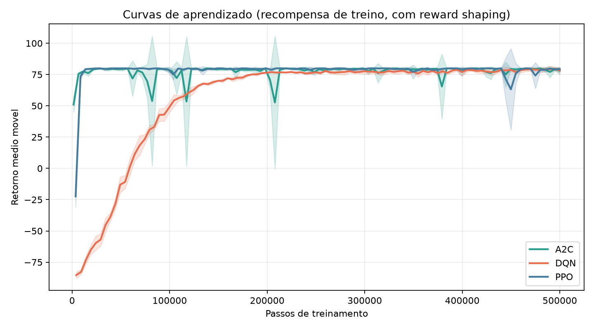
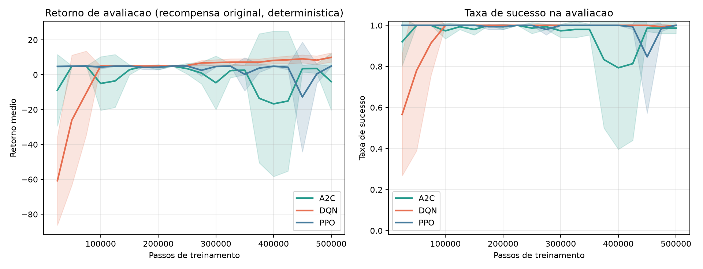
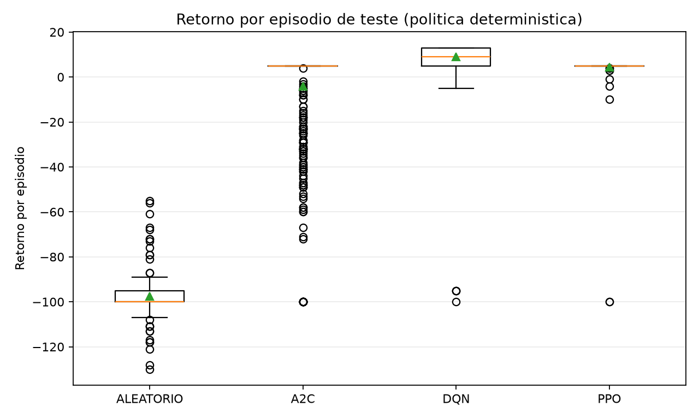
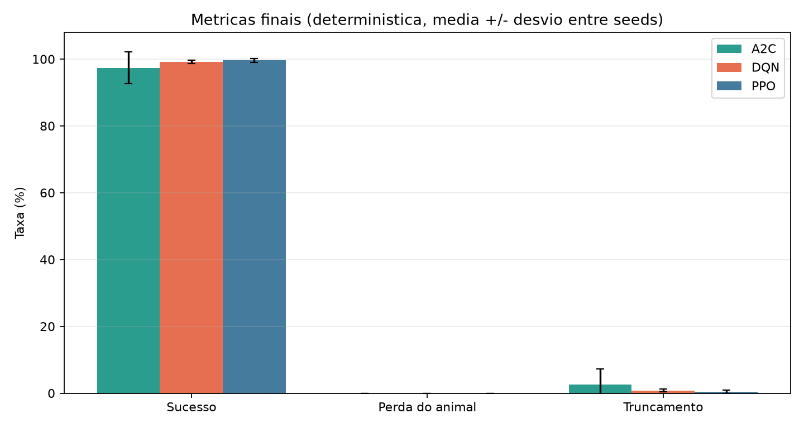
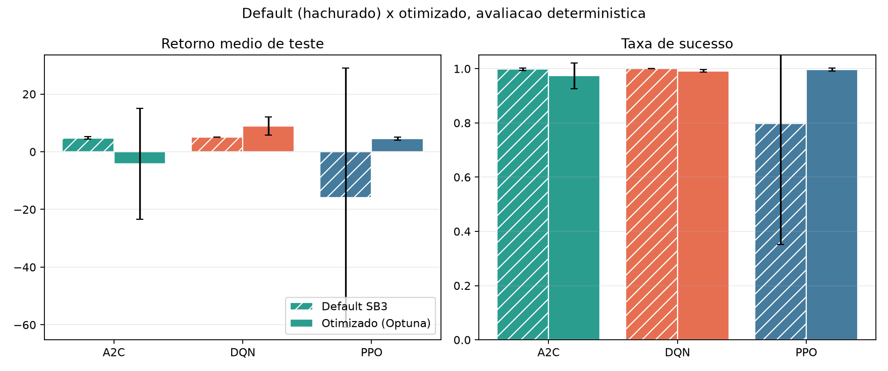
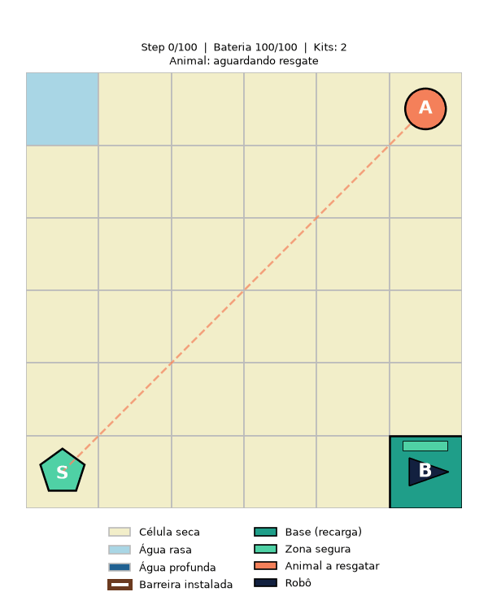

# FloodGuard - Relatorio da Etapa 6

Gerado em `2026-09-20 19:25:04` por `experiments/final_experiments.py`.

## Resumo

Cada algoritmo foi treinado com a melhor configuracao da Etapa 5 ("otimizado") e com os hiperparametros default do SB3, usando as mesmas seeds, o mesmo orcamento e os mesmos episodios de teste, e comparado ao agente aleatorio.

## Configuracao

- Sementes de treino: `42, 123, 2024, 7, 314`.
- Passos de treino por modelo: `500000`.
- Episodios de teste por modelo: `100` (seeds de teste a partir de `50000`; a avaliacao periodica durante o treino usa seeds disjuntas a partir de `90000`).
- **Avaliacao principal: deterministica** (acao de maior valor/probabilidade). E a politica que o algoritmo aprendeu e a unica comparavel entre os tres: no DQN, o modo estocastico do SB3 e epsilon-greedy com o epsilon final do treino.
- A avaliacao estocastica e reportada como secundaria (robustez).
- A avaliacao usa a recompensa original do MDP, sem o reward shaping do treino.

## Resultados (avaliacao deterministica)

Media entre seeds; o termo apos `+/-` e o desvio padrao entre os modelos treinados (no aleatorio, o desvio entre episodios).

| Politica | Retorno | Sucesso | Perda do animal | Truncamento | Bateria usada | Passos ate o sucesso |
|---|---:|---:|---:|---:|---:|---:|
| ALEATORIO | -97.42 +/- 12.80 | 0.00% | 42.00% | 55.00% | 74.64 | n/a |
| A2C (Default SB3) | 4.79 +/- 0.45 | 99.80% +/- 0.45% | 0.00% +/- 0.00% | 0.20% +/- 0.45% | 15.26 | 15.02 |
| DQN (Default SB3) | 5.00 +/- 0.00 | 100.00% +/- 0.00% | 0.00% +/- 0.00% | 0.00% +/- 0.00% | 15.00 | 15.00 |
| PPO (Default SB3) | -15.86 +/- 44.88 | 79.80% +/- 44.61% | 11.00% +/- 24.60% | 9.20% +/- 20.02% | 13.05 | 15.55 |
| A2C (Otimizado (Optuna)) | -4.12 +/- 19.22 | 97.40% +/- 4.72% | 0.00% +/- 0.00% | 2.60% +/- 4.72% | 15.05 | 22.18 |
| DQN (Otimizado (Optuna)) | 8.96 +/- 3.19 | 99.20% +/- 0.45% | 0.00% +/- 0.00% | 0.80% +/- 0.45% | 34.21 | 16.34 |
| PPO (Otimizado (Optuna)) | 4.51 +/- 0.56 | 99.60% +/- 0.55% | 0.00% +/- 0.00% | 0.40% +/- 0.55% | 15.07 | 15.07 |

## Leitura dos resultados

- **Ranking por retorno (deterministica, otimizado):** DQN (8.96) > PPO (4.51) > A2C (-4.12); agente aleatorio: -97.42.
- **DQN:** sucesso 99.20% (+/- 0.45%), acima do baseline aleatorio em retorno.
- **PPO:** sucesso 99.60% (+/- 0.55%), acima do baseline aleatorio em retorno.
- **A2C:** sucesso 97.40% (+/- 4.72%), acima do baseline aleatorio em retorno.
- **DQN: a otimizacao melhorou** frente ao default do SB3 (retorno 5.00 -> 8.96).
- **PPO: a otimizacao melhorou** frente ao default do SB3 (retorno -15.86 -> 4.51).
- **A2C: a otimizacao nao melhorou** frente ao default do SB3 (retorno 4.79 -> -4.12).
- **DQN:** 1.00% dos episodios deterministicos travaram (>= 10 passos sem efeito); sucesso estocastico 99.80% contra 99.20% deterministico.
- **PPO:** 0.60% dos episodios deterministicos travaram (>= 10 passos sem efeito); sucesso estocastico 100.00% contra 99.60% deterministico.
- **A2C:** 19.60% dos episodios deterministicos travaram (>= 10 passos sem efeito); sucesso estocastico 97.80% contra 97.40% deterministico.
- **Referencia do MDP:** resgate direto (15 passos) rende 5.00; instalar 2 barreiras efetivas no caminho rende ate 13.00 (+recompensa de barreira, -1 passo cada). Retornos acima do resgate direto indicam uso de barreiras.
- Barreiras efetivas por episodio (deterministica): DQN 1.23, PPO 0.00, A2C 0.00; aleatorio 0.09.

## Avaliacao estocastica (secundaria)

PPO/A2C amostram da distribuicao de acoes; o DQN usa epsilon-greedy com o epsilon final do treino. Os modos nao sao equivalentes entre algoritmos; a tabela serve para medir a sensibilidade a ruido de politica.

| Politica | Retorno | Sucesso | Perda do animal | Truncamento | Bateria usada | Passos ate o sucesso |
|---|---:|---:|---:|---:|---:|---:|
| ALEATORIO | -97.42 +/- 12.80 | 0.00% | 42.00% | 55.00% | 74.64 | n/a |
| A2C (Default SB3) | 4.79 +/- 0.45 | 99.80% +/- 0.45% | 0.00% +/- 0.00% | 0.20% +/- 0.45% | 15.30 | 15.02 |
| DQN (Default SB3) | 4.21 +/- 0.13 | 100.00% +/- 0.00% | 0.00% +/- 0.00% | 0.00% +/- 0.00% | 17.38 | 15.79 |
| PPO (Default SB3) | -15.56 +/- 45.50 | 80.20% +/- 44.27% | 8.40% +/- 18.78% | 11.40% +/- 25.49% | 13.39 | 26.18 |
| A2C (Otimizado (Optuna)) | -3.90 +/- 18.70 | 97.80% +/- 3.83% | 0.00% +/- 0.00% | 2.20% +/- 3.83% | 15.09 | 22.24 |
| DQN (Otimizado (Optuna)) | 4.75 +/- 1.83 | 99.80% +/- 0.45% | 0.00% +/- 0.00% | 0.20% +/- 0.45% | 37.34 | 19.61 |
| PPO (Otimizado (Optuna)) | 4.90 +/- 0.08 | 100.00% +/- 0.00% | 0.00% +/- 0.00% | 0.00% +/- 0.00% | 15.09 | 15.10 |

## Diagnostico de travamento (deterministica)

Um passo e "sem efeito" quando robo, bateria, kits e status do animal nao mudam. Um episodio "trava" com ao menos 10 passos seguidos assim.

| Politica | Passos sem efeito | Episodios travados |
|---|---:|---:|
| A2C (Default SB3) | 1.23% | 0.20% |
| DQN (Default SB3) | 0.00% | 0.00% |
| PPO (Default SB3) | 20.45% | 20.40% |
| A2C (Otimizado (Optuna)) | 16.97% | 19.60% |
| DQN (Otimizado (Optuna)) | 4.53% | 1.00% |
| PPO (Otimizado (Optuna)) | 2.63% | 0.60% |

## Ablacoes do PPO (protecao vs. resgate)

Investigam por que as barreiras quase nao sao usadas: sem kits de barreira e sem o reward shaping de progresso (deterministica).

| Variante | Retorno | Sucesso | Perda do animal | Truncamento | Barreiras efetivas |
|---|---:|---:|---:|---:|---:|
| PPO otimizado (referencia) | 4.51 +/- 0.56 | 99.60% +/- 0.55% | 0.00% +/- 0.00% | 0.40% +/- 0.55% | 0.00 |
| PPO otimizado sem barreiras | 4.71 +/- 0.51 | 99.80% +/- 0.45% | 0.00% +/- 0.00% | 0.20% +/- 0.45% | 0.00 |
| PPO otimizado sem reward shaping | -12.70 +/- 41.72 | 79.60% +/- 44.51% | 7.20% +/- 16.10% | 13.20% +/- 28.41% | 0.77 |

## Graficos

### Curvas de aprendizado (recompensa de treino, inclui shaping)

### Avaliacao periodica durante o treino (recompensa original, deterministica)

### Retorno nos episodios de teste

### Taxas finais

### Default x otimizado

### Episodio de teste por algoritmo (modelo otimizado, deterministica)

**A2C**

**DQN**

**PPO**

## Arquivos gerados

- Modelos: `results/models/final`.
- Resultados por seed: `results/final/final_seed_results.csv`.
- Resultados por episodio: `results/final/final_episode_results.csv`.
- Curvas de treino e de avaliacao: `results/final/learning_curves.csv`, `results/final/eval_curves.csv`.
- Resumo em JSON: `results/final/final_summary.json`.
